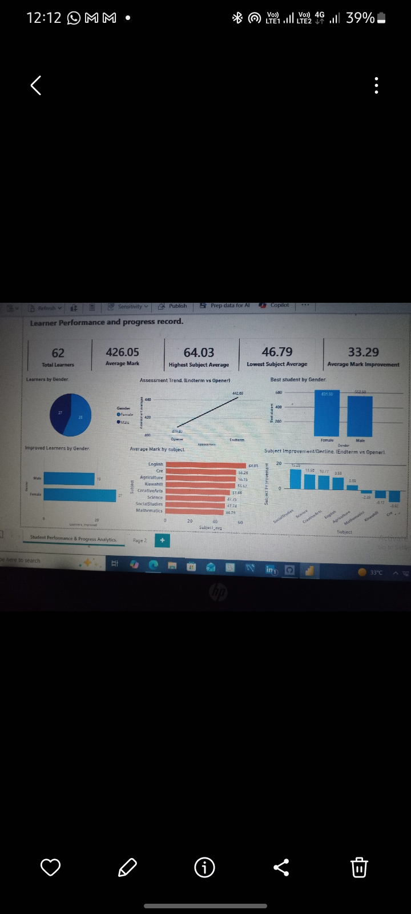

# Learner Performance and Progress analysis
  ## Project Overview
This project demonstrates analysis of a total of 62 learners, Opener and Endterm, assessment results to identify perfomance trends, Learner performance and Subject level strengths and weaknesses by gender.
The project was developed to transform raw learner assessment data into meaningful insights through data preperation, analysis and interactive visualization.
  ## Objectives 
1. Evaluate overall learner performance.
2. Compare performance between the Opener and Endterm Assessments.
3. Identify the best and lowest performing subjects.
4. Identify most improved/declined subjects between Opener and Endterm. 
5. Measure Learner improvement between assessments.
6. Compare performance across Gender.
  ## Tools Used
1. MySQL - data preperation and querying
2. Power BI - data modelling, DAX Calculations and visualization.
3. DAX - analytical calculations and measures.
  ## Dashboard Preview

  ## SQL
I used MySQL to create and prepare the assessment table before analyzing in Power BI. It helped me detect learner with one missing assessment using a Left Outer join.

  ## Key insights
