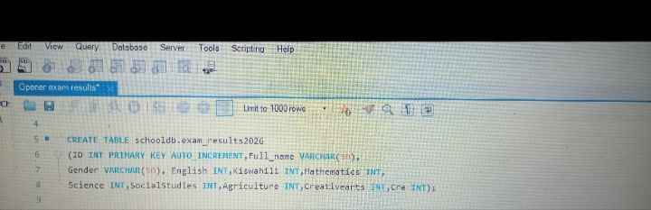
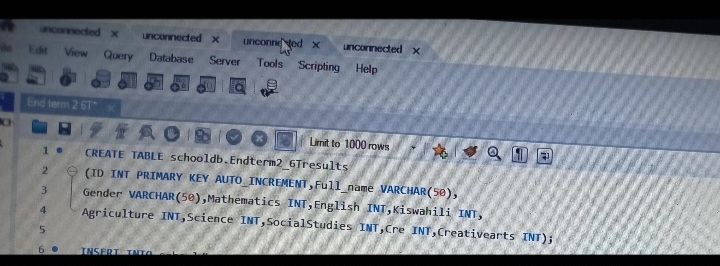
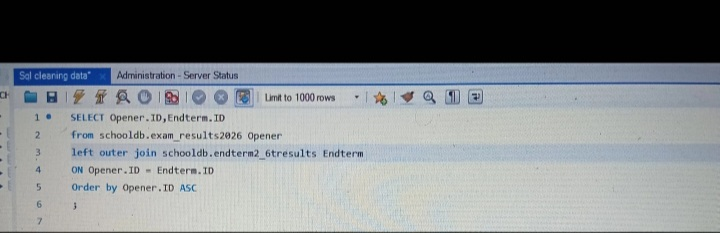
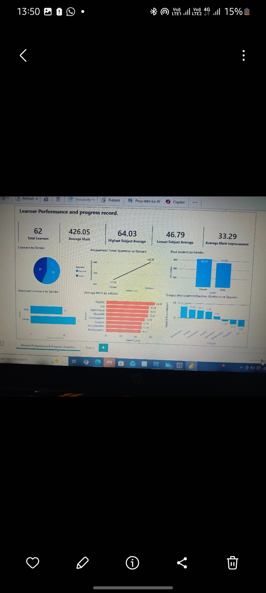

# Learner Performance and Progress analysis
  ## Project Overview
This project demonstrates analysis of a total of 62 learners, Opener and Endterm, assessment results to identify perfomance trends, Learner performance and Subject level strengths and weaknesses.
The project was developed to transform raw learner assessment data into meaningful insights through data preperation, analysis and interactive visualization.
  ## Objectives 
1. Evaluate overall learner performance.
2. Compare performance between the Opener and Endterm Assessments.
3. Identify the best and lowest performing subjects.
4. Identify most improved/declined subjects between Opener and Endterm.
5. Compare performance across Gender.
  ## Tools Used
1. MySQL - data preperation and querying
2. Power BI - data modelling, DAX Calculations and visualization.
3. DAX - analytical calculations and measures.
  ## MySQL
I used MySQL to create and prepare the assessment table before analyzing in Power BI. It helped me detect learner with one missing assessment using a Left Outer join.

  ## Dashboard Preview

  ## Key insights
1. Overall Performance - The average for the opener and endterm assessments was 426.05 marks. The learners had an overall improvement of 33.29 points from Opener to Endterm. This indicates a substantial improvement across learner population.
2. Learner Performance- The learners have an average difference of 118.68 points by gender. This is a huge mark gap that indicates girls are performing better than the boys.
3. Subject performance - Social Studies is the most improved subject whereas Mathematics, Kiswahili and Cre have recorded a significant decline. English was the best performed subject with an average mark of 64.03 whereas the least performed was Mathematics with an average mark of 46.79.
This shows that subject teachers need to intervene further.
   ## Conclusion
This is a project that demonstrates the use of MySQL and Power BI to analyze overall learner performance, performance between the Opener and Endterm Assessments, the best and lowest performing subjects, most improved/declined subjects between Opener and Endterm, performance across Gender. This analysis provides a clear view of learner performance and progress supporting data-driven understanding of academic progress.
